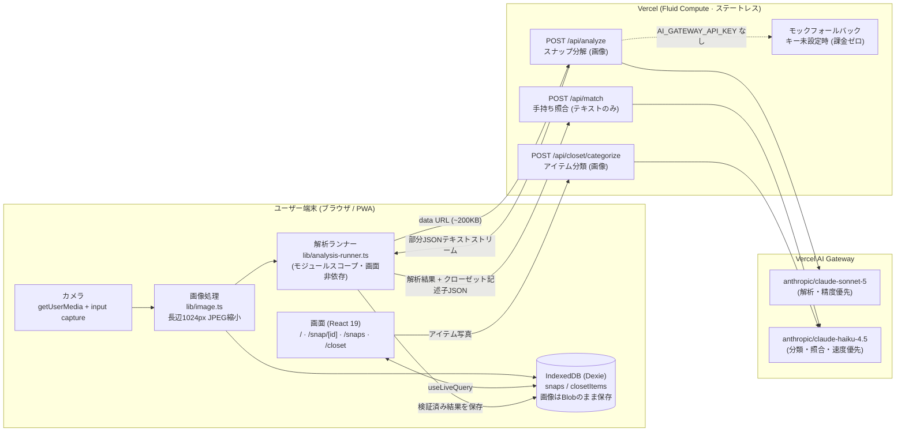
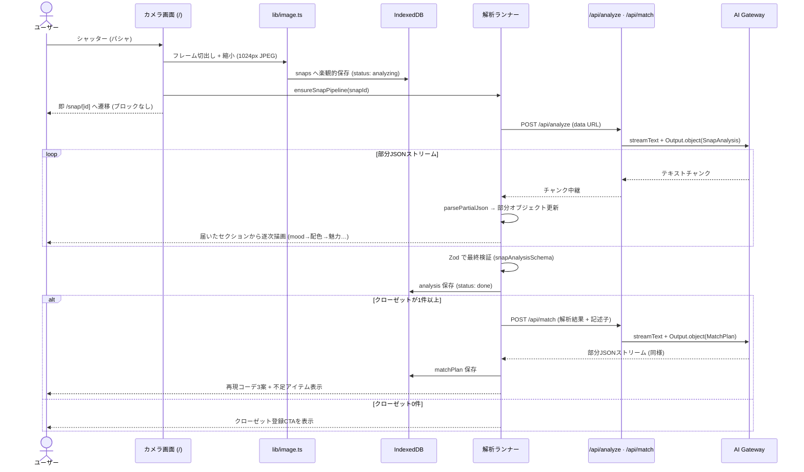

# 03. アーキテクチャ

## 全体構成図 (システム構成)

サーバDBを持たない**ローカルファースト + ステートレスAI中継**構成。



要点:

- **データの所有権は端末**。サーバは「画像/記述子を受け取りAIの部分JSONを中継する」だけで、何も保存しない
- **画面と解析の分離**: 解析は React コンポーネントでなくモジュールスコープのランナーが実行。画面遷移・アンマウントに影響されず完走し、UI は `useLiveQuery` (IndexedDB) と `useSyncExternalStore` (進行中の部分オブジェクト) で追従する
- **照合は画像を送らない**: クローゼットはテキスト記述子 (`ClosetDescriptor`) のみ送信し、高速・低コスト・低プライバシー露出にする

## シーケンス図 (パシャ → 解析 → 照合)



## 技術スタックと選定理由

| 層 | 選定 | 理由 (詳細は ADR) |
|---|---|---|
| フレームワーク | Next.js 16 App Router | ワークスペース標準スターター。APIルートとPWAが1リポジトリで完結 |
| 永続化 | Dexie (IndexedDB) | [ADR-0002](adr/0002-local-first-indexeddb.md) — ローカルファースト |
| AIストリーミング | ai@6 `streamText+Output.object` / 自作 `fetch+parsePartialJson` | [ADR-0003](adr/0003-partial-json-streaming-custom-client.md) |
| AIモデル | AI Gateway 経由 Sonnet 5 / Haiku 4.5 の2モデル | [ADR-0004](adr/0004-two-model-strategy-ai-gateway.md) |
| バリデーション | Zod v4 (`lib/ai/schemas.ts` が唯一の原本) | AI出力・APIボディ・保存データの型を1本化 |
| UI | Tailwind v4、Shippori Mincho + Zen Kaku Gothic New | 常時ダークのエディトリアルトーン |

## レイヤ構造

```text
src/
├── app/                    # 画面 (4) + APIルート (3)
├── components/             # camera-capture / tab-nav / ui-bits
└── lib/
    ├── ai/
    │   ├── schemas.ts      # AI入出力の Zod スキーマ (唯一の原本)
    │   ├── prompts.ts      # system プロンプト + 表現ポリシー (断定禁止)
    │   ├── gateway.ts      # AI Gateway クライアント (DEFAULT_MODEL / FAST_MODEL)
    │   ├── client.ts       # 部分JSONストリーム消費 (fetch + parsePartialJson)
    │   └── mock.ts         # モック応答 + 擬似ストリーム
    ├── analysis-runner.ts  # 解析→照合パイプライン (画面非依存 singleton)
    ├── db/local.ts         # Dexie 層 (snaps / closetItems / 集計)
    ├── image.ts            # 縮小・サムネ・フレーム切出し
    └── env.ts              # 環境変数 Zod 検証 (唯一の窓口)
```

依存方向: `app → components → lib`、`lib/ai/schemas.ts` は全層から参照される型の原本。

## 認証・認可

なし (意図的)。ローカルファーストのため保護すべきサーバ側ユーザーデータが存在しない。
APIルートは入力検証 (Zod) のみ。公開サービス化する場合はレート制限を先に入れる。

## 外部サービス連携

Vercel AI Gateway のみ (`AI_GATEWAY_API_KEY`)。未設定時はモックに自動フォールバック。

## デプロイ構成

- Vercel (Fluid Compute)。APIルートは `maxDuration 60〜120s`
- カメラは HTTPS 必須のため、実機検証は preview デプロイ以降
- CI: GitHub Actions (`lint / typecheck / test / build`)
