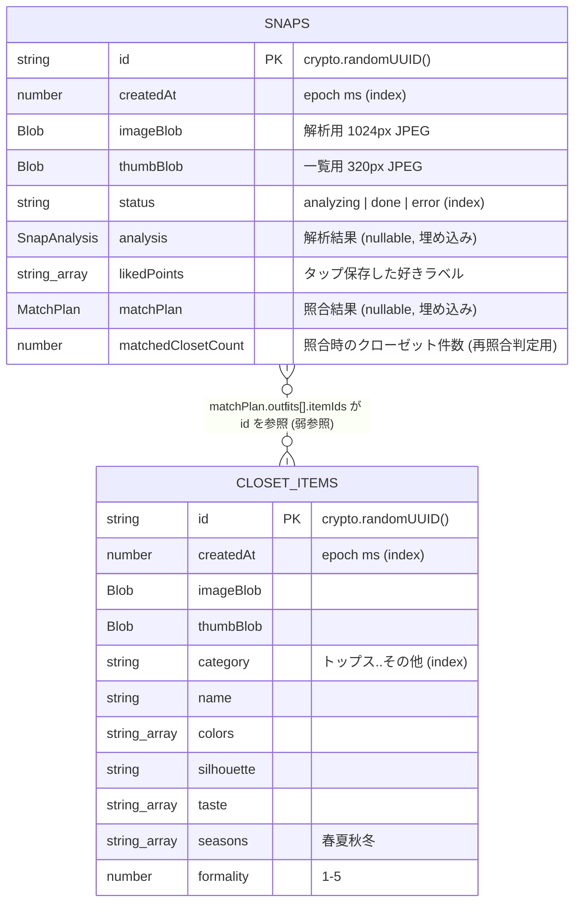

# 04. ER 図 (IndexedDB / Dexie)

サーバDBは存在しない。全データは端末内 IndexedDB (`spead_wear_neo` データベース) に保存される。
スキーマ定義の原本: `src/lib/db/local.ts` (ストア) + `src/lib/ai/schemas.ts` (埋め込みオブジェクトの型)。

## エンティティ一覧

| ストア | 役割 | 主キー |
|---|---|---|
| `snaps` | 撮影した憧れスナップ + 解析結果 + 好きポイント + 照合結果 | `id` (UUID) |
| `closetItems` | 手持ち服 (AI自動分類された属性つき) | `id` (UUID) |

## ER 図



## 埋め込みオブジェクト (正規化しない)

IndexedDB はドキュメント指向のため、解析・照合結果は行分割せず `snaps` に埋め込む。

- `analysis: SnapAnalysis` — mood / taste / silhouette / colorPalette{colors[{name,hex}], tone, contrast} / keyItems / formality / season / layering / appealPoints[{label,why}] / reproductionEssentials
- `matchPlan: MatchPlan` — outfits[{title, itemIds[], styling, closeness, gapNotes}] / missingItems[{name, category, priority, reason, alternatives}] / skipBuying[{name, reason}]

## 参照整合性の扱い

- `matchPlan.outfits[].itemIds` → `closetItems.id` は**弱参照**。アイテム削除時に matchPlan は更新しない
  (表示側が `Map` 引きで存在するものだけ描画する)。クローゼット件数が変わるとスナップ再訪時に自動再照合される (`matchedClosetCount` 比較)
- 好みプロファイルはテーブルを持たず、`snaps.likedPoints` の集計から毎回導出する (`aggregateLikedPoints`)

## インデックス方針

```ts
db.version(1).stores({
  snaps: "id, createdAt, status",       // 一覧の新着順 + 解析中フィルタ
  closetItems: "id, createdAt, category", // 一覧の新着順 + カテゴリ絞り込み (将来)
});
```

Blob・埋め込みオブジェクトはインデックス不要のため列挙しない (Dexie はインデックス定義のみ書く)。

## RLS ポリシー方針

該当なし (サーバDBなし)。データ保護は「端末から出さない」ことで担保し、
外部送信は AI 解析リクエスト (画像 data URL / テキスト記述子) のみ。

## マイグレーション方針

スキーマ変更時は `db.version(n+1).stores({...}).upgrade(tx => ...)` を追加する (Dexie 標準)。
既存フィールドの型変更は避け、追加フィールドは nullable にする。
