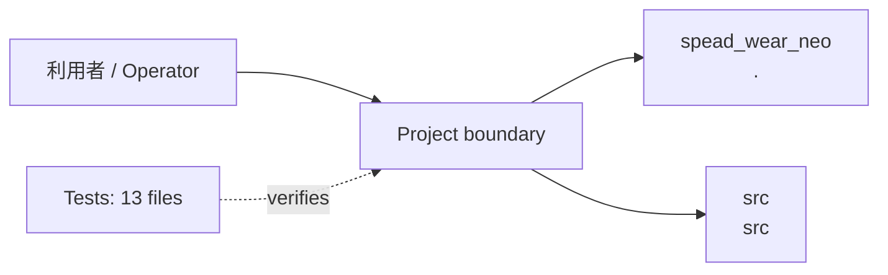
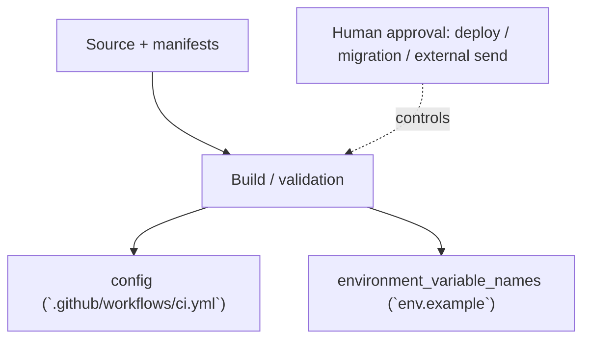

<!-- generated-by: scripts/generate_engineering_docs.py -->
# SPEAD WEAR - Shazam for Fashion Snap — アーキテクチャ・システム構成

> 生成日: 2026-07-15 / 対象: `spead_wear_neo` / 確度: [高]
> 実装・manifest・既存資料の静的棚卸しに基づく。外部サービスの稼働状態と本番構成は未検証。

## 論理アーキテクチャ

## 配備・実行構成

## コンポーネント責務

| Component | Path | 責務 |
|---|---|---|
| `spead_wear_neo` | `.` | 責務は実装と既存READMEを確認 |
| `src` | `src` | 中核実装。詳細は配下moduleを参照 |

### 検出したruntime / service

- `config (`.github/workflows/ci.yml`)`
- `environment_variable_names (`env.example`)`

## 実装境界

- UI/入口: `src/app/page.tsx`, `src/app/snaps/page.tsx`, `src/app/snap/[id]/page.tsx`, `src/app/closet/page.tsx`, `src/app/login/page.tsx`
- API: `src/app/api/analyze/route.ts`, `src/app/api/closet/categorize/route.ts`, `src/app/api/login/route.ts`, `src/app/api/match/route.ts`
- Data: 永続schema未検出
- External: integration名を静的検出できず

## セキュリティ境界

- 認証・回復性の実装シグナル: resilience (`src/app/api/match/route.ts`), resilience (`src/app/api/analyze/route.ts`), resilience (`src/app/api/closet/categorize/route.ts`), auth/session (`src/lib/__tests__/ai-routes-security.test.ts`), rate-limit (`src/lib/__tests__/ai-routes-security.test.ts`), resilience (`src/lib/__tests__/ai-routes-security.test.ts`), auth/session (`src/lib/__tests__/distributed-quota.test.ts`), resilience (`src/lib/__tests__/distributed-quota.test.ts`), auth/session (`src/lib/ai/distributed-quota.ts`), resilience (`src/lib/ai/distributed-quota.ts`), rate-limit (`src/lib/ai/request-guard.ts`), resilience (`src/lib/ai/request-guard.ts`)
- 設定名: APP_URL, NODE_ENV（値は収集していない）
- deploy、migration、外部送信、課金はHuman Approval Gate対象。
