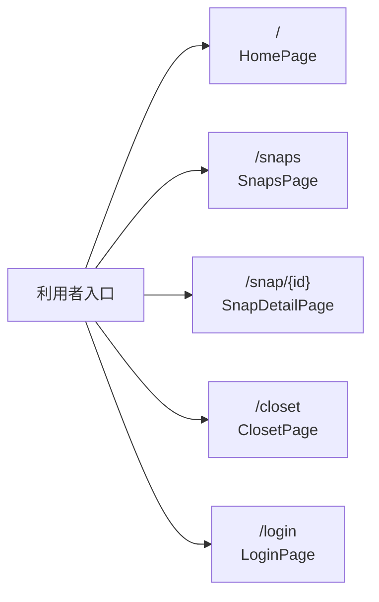

<!-- generated-by: scripts/generate_engineering_docs.py -->
# SPEAD WEAR - Shazam for Fashion Snap — 画面設計書

> 生成日: 2026-07-15 / 対象: `spead_wear_neo` / 確度: [高]
> 実装・manifest・既存資料の静的棚卸しに基づく。外部サービスの稼働状態と本番構成は未検証。

## 画面・入口一覧

| Route / Screen | Component | 目的（pathから推定） | 実装interaction | 必須状態 | 実装根拠 |
|---|---|---|---|---|---|
| `/` | `HomePage` | トップ/入口 | navigation | default, error/permission要確認 | `src/app/page.tsx` |
| `/snaps` | `SnapsPage` | snaps | 表示/操作は実装参照 | default, error/permission要確認 | `src/app/snaps/page.tsx` |
| `/snap/{id}` | `SnapDetailPage` | snap | button, navigation | default, error/permission要確認 | `src/app/snap/[id]/page.tsx` |
| `/closet` | `ClosetPage` | closet | button, input | initial, validation, submitting, success/error | `src/app/closet/page.tsx` |
| `/login` | `LoginPage` | login | 表示/操作は実装参照 | default, error/permission要確認 | `src/app/login/page.tsx` |

## 基本導線

## 変更時の実務チェック

- API候補: `src/app/api/analyze/route.ts`, `src/app/api/closet/categorize/route.ts`, `src/app/api/login/route.ts`, `src/app/api/match/route.ts`
- schema候補: 永続schema未検出
- 認証/認可、loading、empty、validation、依存障害、permission状態を実装とtestで確認する。
- responsive/accessibilityの対象viewportと操作方法はproject固有の利用者・platformに合わせる。
